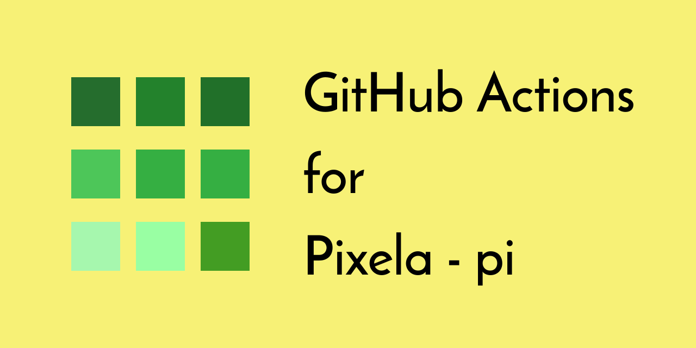

[](https://github.com/peaceiris/actions-pixela/blob/master/LICENSE)
[](https://github.com/peaceiris/actions-pixela/releases/latest)
[](https://github.com/peaceiris/actions-pixela/releases)
[](https://github.com/peaceiris/actions-pixela/actions)
[](https://codecov.io/gh/peaceiris/actions-pixela)
[](https://github.com/peaceiris/actions-pixela/releases.atom)




## GitHub Actions for Pixela (a-know/pi)

- [Pixela | Record and Track your habits or effort. All by API.](https://pixe.la/)
- [a-know/pi: Official CLI tool for Pixela](https://github.com/a-know/pi)

This **Pixela Setup Action** can install **a-know/pi** to a virtual machine of GitHub Actions. Linux (Ubuntu), macOS, and Windows are supported.

| OS (runs-on) | ubuntu-18.04 | macos-latest | windows-latest |
|---|:---:|:---:|:---:|
| Support | ✅️ | ✅️ | ✅️ |


## Table of Contents

<!-- START doctoc generated TOC please keep comment here to allow auto update -->
<!-- DON'T EDIT THIS SECTION, INSTEAD RE-RUN doctoc TO UPDATE -->


- [Getting started](#getting-started)
  - [Add Pixela User Token](#add-pixela-user-token)
  - [Example Workflow](#example-workflow)
  - [Matrix build](#matrix-build)
- [Example Graphs](#example-graphs)
- [CHANGELOG](#changelog)
- [License](#license)
- [About Maintainer](#about-maintainer)
- [Maintainer Notes](#maintainer-notes)

<!-- END doctoc generated TOC please keep comment here to allow auto update -->

*TOC is generated with [DocToc](https://github.com/thlorenz/doctoc)*


## Getting started

### Add Pixela User Token

1. Go to Settings > Secrets.
2. Add your `PIXELA_USER_TOKEN` as a new secret.

### Example Workflow

Workflow file: `.github/workflows/pixela.yml`

```yaml
name: pixela

on:
  push:
    branches:
      - master

jobs:
  increment:
    runs-on: ubuntu-18.04
    steps:
      - uses: actions/checkout@v2

      - name: Setup a-know/pi
        uses: peaceiris/actions-pixela@v2
        with:
          pi_version: '1.1.0'

      - name: Increment
        env:
          PIXELA_USER_TOKEN: ${{ secrets.PIXELA_USER_TOKEN }}
        run: |
          pi pixel increment -u <username> -g <graph-id>
```

### Matrix build

```yaml
name: 'Test'

on:
  push:
    branches:
      - master

jobs:
  test:
    runs-on: ${{ matrix.os }}
    strategy:
      matrix:
        os:
          - 'ubuntu-18.04'
          - 'macos-latest'
          - 'windows-latest'
        include:
          - os: 'ubuntu-18.04'
            graph_id: 'gha-pi-ci-linux'
          - os: 'macos-latest'
            graph_id: 'gha-pi-ci-macos'
          - os: 'windows-latest'
            graph_id: 'gha-pi-ci-win'
    steps:
      - uses: actions/checkout@v2

      - name: Setup pi
        uses: peaceiris/actions-pixela@v2
        with:
          pi_version: '1.1.0'

      - name: Increment
        env:
          PIXELA_USER_TOKEN: ${{ secrets.PIXELA_USER_TOKEN }}
        run: |
          pi pixel increment -u <username> -g '${{ matrix.graph_id }}'
```

<div align="right">
<a href="#table-of-contents">Back to TOC ☝️</a>
</div>


## Example Graphs

*CI Test on Linux Passed*

[](https://pixe.la/v1/users/peaceiris/graphs/gha-pi-ci-linux.html)

*CI Test on macOS Passed*

[](https://pixe.la/v1/users/peaceiris/graphs/gha-pi-ci-macos.html)

*CI Test on Windows Passed*

[](https://pixe.la/v1/users/peaceiris/graphs/gha-pi-ci-win.html)

*Git Push Count*

peaceiris blog repository (private)

[](https://pixe.la/v1/users/peaceiris/graphs/reveltb-push.html)

<div align="right">
<a href="#table-of-contents">Back to TOC ☝️</a>
</div>


## CHANGELOG

- [CHANGELOG.md](CHANGELOG.md)


## License

- [MIT License - peaceiris/actions-pixela]

[MIT License - peaceiris/actions-pixela]: https://github.com/peaceiris/actions-pixela/blob/master/LICENSE


## About Maintainer

- [peaceiris homepage](https://peaceiris.com/)


## Maintainer Notes

Run `npm` and `git commit` commands on a container.

**On Host**

```sh
# Docker
make build
make run
make run cmd="env"
make test
make commit msg="chore: Add Makefile"

# Release
./release.sh
```


<div align="right">
<a href="#table-of-contents">Back to TOC ☝️</a>
</div>
